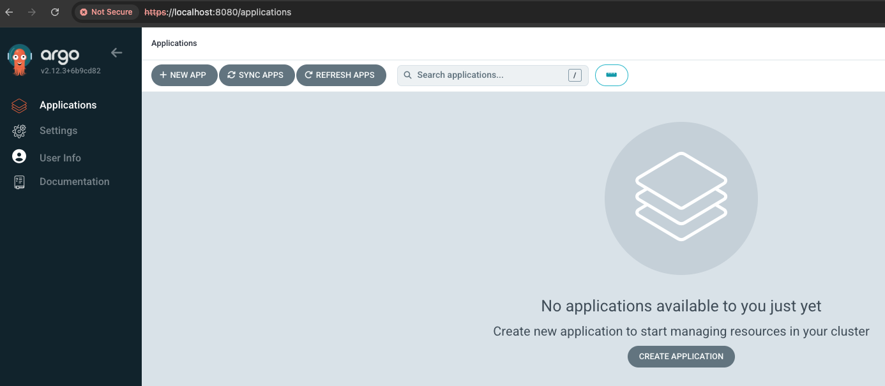
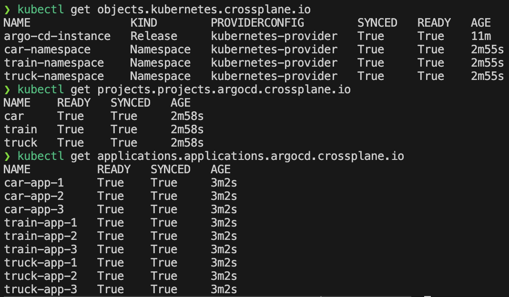
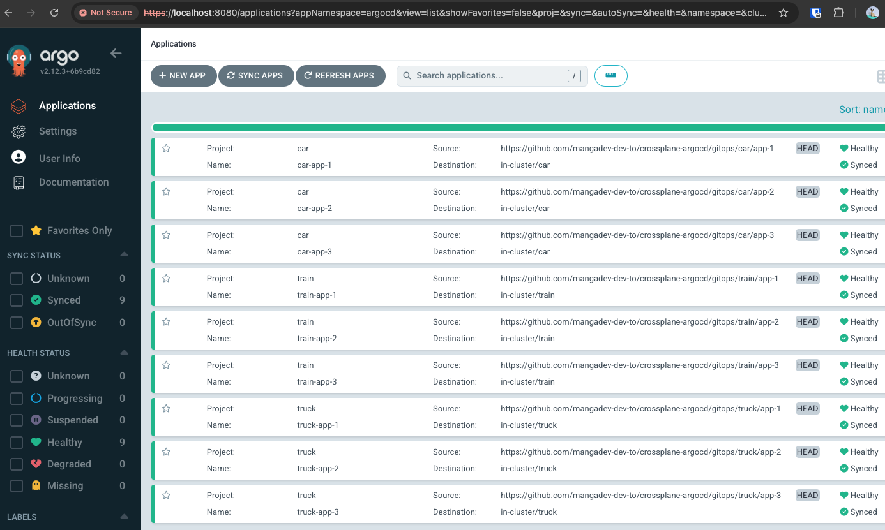
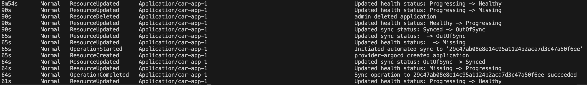

# Crossplane + ArgoCD: A Perfect Match for Kubernetes Automation

https://dev.to/mangadev/crossplane-argocd-a-perfect-match-for-kubernetes-automation-1cc0

## Introduction

Automation is key to managing complex infrastructures and applications efficiently. Two powerful tools that help achieve this are Crossplane and ArgoCD. While Crossplane enables you to manage cloud infrastructure declaratively using Kubernetes, ArgoCD brings GitOps principles to automate the deployment and management of applications.

In this step-by-step guide, I’ll show you how to set up and integrate these two tools on a local Kubernetes cluster using Kind. Whether you're experimenting locally or preparing for a production setup, this tutorial will walk you through the process of provisioning infrastructure and managing your applications with ease. Let’s get started!

If you're new to GitOps or ArgoCD, I highly recommend checking out my previous post: [GitOps + ArgoCD: A Perfect Match for Kubernetes Continuous Delivery](https://dev.to/mangadev/gitops-argocd-a-perfect-match-for-kubernetes-continuous-delivery-5d97) for an introduction to these concepts.

## Hands-on 🚀

### Prerequisites
- [docker desktop](https://www.docker.com/products/docker-desktop/)
- [kubectl](https://kubernetes.io/docs/tasks/tools/)
- [helm](https://helm.sh/docs/intro/install/)
- [kind](https://kind.sigs.k8s.io/docs/user/quick-start)
- [jq](https://jqlang.github.io/jq/download/)
- [VS Code](https://code.visualstudio.com/download) or any other

### **Clone the Hands-on GitHub Repository**
```bash
git clone git@github.com:mangadev-dev-to/crossplane-argocd.git
```

### **Folder Structure**
```bash
├── crossplane
├── gitops
├── kind
└── rendered-resources
```
- **crossplane**: Contains Crossplane configuration, from installation to resources.
- **gitops**: The source of truth for all application manifests (typically stored in a separate repository).
- **kind**: Contains local cluster configuration.
- **rendered-resources**: Contains the rendered Crossplane resources manifests.

### **Create a Kind Cluster**
```bash
kind create cluster --config=kind/kind.yaml --name=crossplane-argocd
```

### **Install Crossplane**: Install Crossplane on your Kind cluster.

```bash
# Ensure you're in the Kind cluster. This command should return 'kind-crossplane-argocd' context.
kubectl config current-context

# Add the Crossplane repository
helm repo add crossplane-stable https://charts.crossplane.io/stable

# Update the local Helm chart cache
helm repo update

# Install the Crossplane Helm chart 
helm install crossplane --namespace crossplane-argocd --create-namespace crossplane-stable/crossplane

# Grant cluster-admin role to Crossplane service account (use with caution in production)
kubectl apply -f crossplane/rbac/clusterrole-admin-binding-crossplane.yaml
```

### **Install Crossplane Providers**: Install Kubernetes and Helm Providers.
```bash
kubectl apply -f crossplane/provider/k8s-provider.yaml 
kubectl apply -f crossplane/provider/k8s-provider-config.yaml
kubectl apply -f crossplane/provider/helm-provider.yaml
kubectl apply -f crossplane/provider/helm-provider-config.yaml

# Grant cluster-admin role to Providers service accounts (use with caution, it's not recommended for production environments)
kubectl apply -f crossplane/rbac/clusterrole-admin-binding-kubernetes-provider.yaml
kubectl apply -f crossplane/rbac/clusterrole-admin-binding-helm-provider.yaml
```

### **Provision Crossplane ArgoCD Instance**: Create an instance of ArgoCD by applying the Kubernetes Object Resource along with Helm.
```bash
# Create argocd namespace and context
kubectl create namespace argocd
kubectl config set-context kind-ns-argocd --namespace argocd --cluster kind-crossplane-argocd --user kind-crossplane-argocd

# Set current context for argocd namespace
kubectl config use-context kind-ns-argocd

# Apply k8s object with ArgoCD Instance Helm
kubectl apply -f crossplane/argocd/argocd-instance.yaml

# Validate if it is up and running (it may take some seconds to get ready)
kubectl get releases.helm.crossplane.io

# Grant cluster-admin role to the ArgoCD service account (use with caution in production)
kubectl apply -f crossplane/argocd/rbac/argocd-svc-account-clusterrole-admin-binding.yaml

# Get the admin password via kubectl
kubectl get secret argocd-initial-admin-secret -o jsonpath="{.data.password}" | base64 -d

# Access the ArgoCD UI (http://localhost:8080) using 'admin' as the username and the copied password
kubectl port-forward service/argocd-instance-server 8080:443
```


### **Install Crossplane ArgoCD Provider**: Install and configure ArgoCD Provider.
```bash
# Create a new ArgoCD user for the provider
kubectl patch configmap/argocd-cm --type merge -p '{"data":{"accounts.provider-argocd":"apiKey"}}'
kubectl patch configmap/argocd-rbac-cm --type merge -p '{"data":{"policy.csv":"g, provider-argocd, role:admin"}}'

# Create an API Token
ARGOCD_ADMIN_SECRET=$(kubectl get secret argocd-initial-admin-secret -o jsonpath="{.data.password}" | base64 -d)

# Port forward the ArgoCD API to the host
kubectl port-forward service/argocd-instance-server 8080:443

# Create a session JWT for the admin user at the ArgoCD API
ARGOCD_ADMIN_TOKEN=$(curl -s -X POST -k -H "Content-Type: application/json" --data '{"username":"admin","password":"'$ARGOCD_ADMIN_SECRET'"}' https://localhost:8080/api/v1/session | jq -r .token)

# Create an API token without expiration for provider-argocd
ARGOCD_PROVIDER_USER="provider-argocd"
ARGOCD_TOKEN=$(curl -s -X POST -k -H "Authorization: Bearer $ARGOCD_ADMIN_TOKEN" -H "Content-Type: application/json" https://localhost:8080/api/v1/account/$ARGOCD_PROVIDER_USER/token | jq -r .token)

# Create a Kubernetes secret from the JWT so provider-argocd can connect to ArgoCD
kubectl create secret generic argocd-credentials -n crossplane-argocd --from-literal=authToken="$ARGOCD_TOKEN"

# Install ArgoCD Provider
kubectl apply -f crossplane/provider/argocd-provider.yaml

# Configure a ProviderConfig with serverAddr pointing to the ArgoCD Instance
kubectl apply -f crossplane/provider/argocd-provider-config.yaml

# Validate if ArgoCD Provider is healthy
kubectl get providers.pkg.crossplane.io crossplane-provider-argocd

# Grant cluster-admin role to ArgoCD Provider service account (use with caution in production)
kubectl apply -f crossplane/rbac/clusterrole-admin-binding-argocd-provider.yaml
```

### **Prepare ArgoCD Resources**: Set up ArgoCD Projects and Applications
```bash
# Render Helm Charts
./resource-helm-template-generator.sh car
./resource-helm-template-generator.sh truck
./resource-helm-template-generator.sh train

# Validate if the rendered Helm Charts are present in the 'rendered-resources' folder
```

### **Create ArgoCD Resources**: Apply the rendered resources
```bash
# Apply the rendered resources
kubectl apply -f rendered-resources/

# Validate the Crossplane objects
kubectl get objects.kubernetes.crossplane.io
kubectl get projects.projects.argocd.crossplane.io
kubectl get applications.applications.argocd.crossplane.io

# Also, validate in the ArgoCD UI (http://localhost:8080) that the applications are up and running
```



### **Time to BREAK THINGS**: Let Crossplane work its reconciliation magic 🪄
1. Delete the `car-app-1` using the ArgoCD UI.
2. Crossplane shall reconcile and recreate it (it may take some seconds)
3. After some seconds the `car-app-1` will be recreated and showed in the UI again.

```bash
# Check the Kubernetes events for more details
kubectl events
```


- 8m54s: 
  - The application `car-app-1` transitioned from "Progressing" to "Healthy" status, indicating it reached a stable state.
- 90s:
  - The application `car-app-1` transitioned from "Progressing" to "Missing," suggesting that the resource went missing or was deleted.
  - An admin deleted the application `car-app-1`.
  - The application's health status changed from "Healthy" to "Progressing," showing a new change or re-deployment began.
  - The sync status changed from "Synced" to "OutOfSync," indicating the application's actual state no longer matched the desired state defined in Git.
- 65s:
  - The sync status of `car-app-1` was updated to "OutOfSync," confirming it was still not in sync.
  - The health status of `car-app-1` changed to "Missing," meaning the resource was not present.
  - An automated sync operation was initiated to commit 29c47ab08e8e14c95a1124b2aca7d3c47a50f6ee.
  - The provider provider-argocd created the application `car-app-1`.
- 64s:
  - The application's sync status changed from "OutOfSync" to "Synced," meaning it matched the desired state from Git again.
  - The health status moved from "Missing" to "Progressing," indicating it was being set up or restored.
  - The sync operation to commit 29c47ab08e8e14c95a1124b2aca7d3c47a50f6ee completed successfully.
- 61s: 
  - The application `car-app-1` transitioned from "Progressing" to "Healthy," meaning it reached a stable and desired state once more.

## **Final Thoughts**
In the previous post [GitOps + ArgoCD: A Perfect Match for Kubernetes Continuous Delivery](https://dev.to/mangadev/gitops-argocd-a-perfect-match-for-kubernetes-continuous-delivery-5d97), we explored how to automate application deployments using GitOps with ArgoCD. Now, we've taken it a step further. As demonstrated, ArgoCD applications are actively monitored and managed by Crossplane, ensuring that any accidental deletions by a developer or unexpected incidents are swiftly corrected. Crossplane automatically reconciles the state and re-establishes the desired configuration, providing enhanced robustness, resilience, and reliability for your infrastructure.

By integrating Crossplane with ArgoCD, you've created a powerful, self-healing environment that maintains your desired state, reducing downtime, mitigating risks, and enhancing operational efficiency.

That's it! Happy coding! 🎉🎉🎉